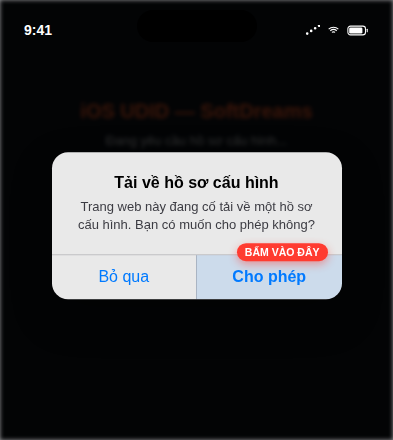
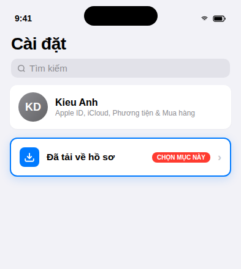
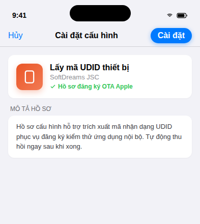
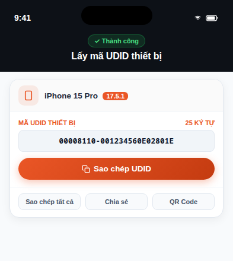

# 📱 iOS UDID Web

> **Công cụ web lấy mã UDID thiết bị iOS tức thì qua giao thức Apple OTA Profile Service.**  
> Nhanh chóng, chuẩn xác 100%, không cần kết nối máy tính, không cần iTunes / Finder hay phần mềm bên thứ ba.

<p align="center">
  <a href="https://web-udid.onrender.com" target="_blank" rel="noopener noreferrer">
    
  </a>
  <a href="https://web-udid.onrender.com" target="_blank" rel="noopener noreferrer">
    
  </a>
</p>

> 🌐 **Website đang chạy thực tế:** [https://web-udid.onrender.com](https://web-udid.onrender.com)

---

## 🌟 Tính Năng Nổi Bật

- ⚡ **Lấy UDID tức thì**: Thao tác chỉ 2–3 chạm ngay trên iPhone/iPad, không cần máy tính, cáp nối hay iTunes.
- 📱 **Nhận diện thiết bị chính xác**: Tự động dịch mã phần cứng sang tên thương mại (iPhone 16 Pro Max, iPhone 15...) cùng iOS version và số Serial.
- 🛡️ **Bảo mật & Tự dọn dẹp**: Profile Service tạm thời tự động biến mất khỏi máy sau khi lấy xong; phiên làm việc tự hủy khỏi RAM sau 5–10 phút.
- 🧭 **Tự phát hiện trình duyệt**: Nhận biết và hướng dẫn chuyển sang Safari nếu mở từ Chrome, Firefox hoặc in-app browser (Zalo, Messenger, Facebook, TikTok...).
- 📋 **Sao chép & Chia sẻ 1 chạm**: Nút copy nhanh UDID, copy toàn bộ thông số máy và hỗ trợ Web Share API.
- 💻 **Mã QR chuyển máy tính**: Tích hợp sẵn QR Code canvas để dễ dàng chuyển mã UDID sang máy tính làm việc.
- 🚀 **Siêu nhẹ & Hiệu năng cao**: Node.js thuần (`node:http`), chỉ đúng 2 dependencies (`node-forge`, `plist`), thời gian phản hồi mili-giây.
- 📲 **Hỗ trợ Web Clip & Demo Mode**: Có profile thêm icon ra Màn hình chính và đường dẫn demo (`/result?demo=1`) để xem trước giao diện.

---

## 📖 Hướng Dẫn Sử Dụng

### 📹 Video Hướng Dẫn Thao Tác

<div align="center">
  <video src="https://github.com/user-attachments/assets/d235f205-9acc-44a7-91d6-bc5bb5e881a3" controls="controls" width="340" style="max-width: 100%; border-radius: 16px; box-shadow: 0 8px 30px rgba(0,0,0,0.15);">
  </video>
  <br>
  <em>🎬 Video thao tác lấy UDID thực tế trên iPhone / iPad (Xem trực tiếp trên GitHub)</em>
</div>

---

### 📱 4 Bước Lấy UDID Trực Tiếp Trên iPhone / iPad

| Bước 1: Tải hồ sơ cấu hình | Bước 2: Mở Cài đặt máy |
|:---:|:---:|
|  |  |
| Mở link web bằng **Safari** → Bấm **Lấy UDID ngay** → Chọn **Cho phép (Allow)**. | Mở ứng dụng **Cài đặt (Settings)** → Chọn **"Đã tải về hồ sơ"** ở đầu danh sách. |

| Bước 3: Cài đặt & Nhập mật mã | Bước 4: Nhận kết quả UDID |
|:---:|:---:|
|  |  |
| Bấm **Cài đặt** ở góc trên bên phải → Nhập mật mã máy (nếu có) → Xác nhận. | Safari tự động mở lại → Bấm **Sao chép UDID** để gửi cho quản trị viên. |

<details>
<summary><b>🔍 Xem hướng dẫn chi tiết từng thao tác:</b></summary>

1. **Bước 1: Tải hồ sơ cấu hình tạm thời**
   - Mở trình duyệt **Safari** trên thiết bị iOS và truy cập website. *(Lưu ý: Bắt buộc dùng Safari, không dùng Chrome, Firefox hoặc trình duyệt in-app trong Zalo, Messenger, Facebook).*
   - Bấm nút **"Lấy UDID ngay"**.
   - Hộp thoại hệ thống xuất hiện: *"Trang web này đang cố tải về một hồ sơ cấu hình..."* -> Chọn **Cho phép (Allow)** -> Bấm **Đóng**.

2. **Bước 2: Vào Cài đặt hệ thống (Settings)**
   - Trở về màn hình chính của iPhone/iPad, mở ứng dụng **Cài đặt (Settings)**.
   - Ngay phía dưới phần thông tin Apple ID, bạn sẽ thấy mục **"Đã tải về hồ sơ" (Profile Downloaded)** -> Bấm vào mục này.

3. **Bước 3: Xác nhận Cài đặt hồ sơ**
   - Tại góc trên bên phải màn hình cấu hình, bấm **Cài đặt (Install)**.
   - Nhập **mật mã mở khóa máy** (Passcode) của bạn khi được yêu cầu.
   - Nhấn **Cài đặt (Install)** thêm một lần nữa ở popup dưới cùng để xác nhận.

4. **Bước 4: Nhận mã UDID & Sao chép**
   - Thiết bị sẽ tự động xử lý và chuyển bạn quay trở lại Safari.
   - Màn hình kết quả sẽ hiện rõ: **Mã UDID**, Tên thiết bị (*ví dụ: iPhone 16 Pro Max, iPhone 15 Pro*), phiên bản iOS.
   - Bấm **"Sao chép UDID"** hoặc dùng nút **"Chia sẻ"** để gửi kết quả ngay cho người quản trị / lập trình viên.
   - *Hồ sơ cấu hình này là Profile Service tạm thời và đã được iOS tự động xóa sạch khỏi máy ngay sau khi lấy xong.*

</details>

---

### 💡 Mẹo Tiện Ích

- **Thêm vào Màn hình chính (Add to Home Screen)**:  
  Tại Safari, bấm nút **Chia sẻ** (Share icon ở thanh công cụ dưới cùng) → Cuộn xuống chọn **Thêm vào MH chính** (Add to Home Screen) → Bấm **Thêm**. Bạn sẽ có một icon ứng dụng để mở nhanh Safari cho những lần lấy UDID tiếp theo.
- **Quét mã QR từ máy tính**:  
  Nếu bạn mở website trên máy tính hoặc chia sẻ cho đồng nghiệp, trang web sẽ có sẵn mã QR. Bạn chỉ cần mở ứng dụng Camera trên iPhone quét mã QR để mở trực tiếp trong Safari.

---

## 🔄 Cơ Chế Hoạt Động (Apple OTA Profile Service Flow)

Theo cơ chế quản lý cấu hình chuẩn của Apple (Over-The-Air Profile Delivery):

```text
[1] Người dùng (Safari)   ── GET / ───────────────►  Server sinh Token & render giao diện
[2] Bấm "Lấy UDID ngay"   ── GET /enroll?t=TOKEN  ►  Server trả về file .mobileconfig (Profile Service)
[3] Safari tải Profile    ── Mở Cài đặt máy      ►  Người dùng xác nhận "Cài đặt" trong Settings
[4] Daemon iOS (Hệ thống) ── POST /callback ──────►  Server nhận binary PKCS#7 DER chứa UDID & Token
[5] Server giải mã        ── Trả về HTTP 301 ─────►  Location: /result?t=TOKEN
[6] iOS đóng Cài đặt      ── Mở lại Safari ───────►  Trang /result hiển thị UDID + Nút Sao chép
```

> **⚠️ Lưu ý kỹ thuật quan trọng từ Apple:**
> - Bước **[4]** được thực thi bởi **tiến trình nền của hệ điều hành iOS** (không phải trình duyệt Safari). Do đó không có cookie, không có phiên đăng nhập thông thường; server dùng trường `Challenge` trong profile để định danh phiên làm việc.
> - Bước **[5]** server **bắt buộc phải phản hồi mã HTTP `301 Moved Permanently`**. Đây là quy chuẩn bắt buộc của Apple để iOS biết đã gửi dữ liệu thành công và tự động chuyển hướng màn hình về lại Safari.
> - iOS **bắt buộc máy chủ phải dùng giao thức `https://` với chứng chỉ SSL/TLS công cộng hợp lệ** (Let's Encrypt, Cloudflare, DigiCert...). Chứng chỉ tự ký (Self-signed) sẽ bị iOS từ chối ngầm mà không có thông báo lỗi.

---

## 📁 Cấu Trúc Thư Mục

```text
ios-udid-web/
├── certs/
│   ├── webclip.mobileconfig          # File cấu hình Web Clip mẫu (chưa ký)
│   └── webclip.signed.mobileconfig   # File cấu hình Web Clip đã ký số (nếu có)
├── public/
│   ├── img/                          # Icon ứng dụng, video GIF & ảnh minh họa từng bước, QR Canvas script
│   ├── index.html                    # Màn hình trang chủ: Nút lấy UDID, Timeline hướng dẫn, cảnh báo non-Safari
│   ├── result.html                   # Màn hình kết quả: Thẻ UDID, thông tin máy, nút Copy, QR Code
│   ├── robots.txt                    # Quy tắc chỉ mục cho bot tìm kiếm, bảo mật trang kết quả
│   └── style.css                     # Toàn bộ CSS giao diện Dark Mode cao cấp
├── scripts/
│   └── sign.sh                       # Script bash ký số file .mobileconfig bằng OpenSSL
├── src/
│   ├── devices.js                    # Bảng tra cứu mã định danh phần cứng (Model Identifier -> Tên thương mại)
│   ├── mobileconfig.js               # Module khởi tạo XML Payload Profile Service kèm Challenge Token
│   ├── pkcs7.js                      # Module bóc tách ASN.1 DER CMS/PKCS#7 lấy dữ liệu thiết bị
│   ├── server.js                     # HTTP Server chính (`node:http`), router xử lý các endpoint
│   ├── store.js                      # Quản lý bộ nhớ phiên (In-memory Map), cơ chế tự động dọn dẹp theo TTL
│   └── ua.js                         # Kiểm tra User-Agent, lọc Safari thật trên iPhone / iPad
├── test/
│   ├── test-core.js                  # Unit test cho: UA detector, store, mobileconfig, pkcs7, devices
│   └── test-server.js                # Integration test cho toàn bộ HTTP endpoints
├── .env.example                      # File mẫu biến môi trường
├── package.json                      # Thông tin dự án và scripts khởi chạy
└── render.yaml                       # Blueprint Infrastructure-as-Code cho Render
```

---

## ⚙️ Yêu Cầu Hệ Thống

- **Node.js**: Phiên bản `>= 20.0.0` (hỗ trợ native ESM và `process.loadEnvFile`).
- **NPM**: Phiên bản `>= 9.x`.
- **Tên miền có HTTPS**: Có chứng chỉ SSL/TLS công cộng hợp lệ (Let's Encrypt, Cloudflare SSL...).

---

## 🚀 Hướng Dẫn Cài Đặt & Chạy Cục Bộ

### 1. Cài đặt mã nguồn

```bash
# Clone repository
git clone <URL_REPOSITORY>
cd ios-udid-web

# Cài đặt các gói phụ thuộc (chỉ 2 packages: node-forge & plist)
npm install
```

### 2. Thiết lập cấu hình môi trường

Sao chép file `.env.example` thành `.env`:

```bash
cp .env.example .env
```

Chỉnh sửa file `.env` theo nhu cầu:

```env
# URL công khai truy cập website (bắt buộc dùng HTTPS trên production)
# Khi test trên mạng LAN / máy ảo qua tunnel (Cloudflare Tunnel, ngrok):
BASE_URL=https://udid.yourdomain.com

# Cổng lắng nghe của Node.js server
PORT=3005

# Thời gian tồn tại của mỗi phiên lấy UDID (300000 ms = 5 phút)
TOKEN_TTL_MS=300000

# Tên tổ chức hiển thị trên thông tin Profile iOS
ORG_NAME=Softdreams
```

> **💡 Mẹo phát triển cục bộ:**  
> Vì iOS bắt buộc HTTPS để tải profile, khi test trên máy thật qua mạng nội bộ, bạn có thể dùng [Cloudflare Tunnel](https://developers.cloudflare.com/cloudflare-one/connections/connect-networks/) (`cloudflared tunnel --url http://localhost:3005`) hoặc `ngrok http 3005` để có URL HTTPS công cộng miễn phí gán vào `BASE_URL`.

### 3. Khởi chạy ứng dụng

```bash
# Chế độ phát triển (tự động reload khi sửa code)
npm run dev

# Chế độ thông thường
npm start
```

Mở trình duyệt truy cập: `http://localhost:3005` (hoặc URL tunnel HTTPS).

---

## 🧪 Kiểm Thử (Testing)

Dự án đã tích hợp sẵn bộ kiểm thử toàn diện từ unit test core logic đến integration test toàn bộ luồng HTTP:

```bash
npm test
```

Bộ test bao gồm:
1. `test/test-core.js`: Kiểm thử kiểm tra User-Agent, sinh XML Profile Service, bộ nhớ đệm Token Store, trích xuất dữ liệu PKCS#7 và bảng ánh xạ model Apple.
2. `test/test-server.js`: Khởi chạy server ảo và kiểm tra phản hồi của tất cả các route (`/`, `/health`, `/enroll`, `/callback`, `/result`, `/webclip`, `/style.css`, assets ảnh...).

---

## 🌐 Các Endpoint API & Đường Dẫn

| Phương thức | Đường dẫn | Chức năng |
|---|---|---|
| `GET` | `/` | Trang chủ: Khởi tạo phiên, render giao diện và Timeline hướng dẫn |
| `GET` / `HEAD` | `/health` | Kiểm tra trạng thái máy chủ (Healthcheck cho Uptime monitor / Docker / K8s) |
| `GET` | `/enroll?t={token}` | Trả về file `.mobileconfig` (Profile Service) cho iOS |
| `POST` | `/callback` | Nhận binary PKCS#7 chứa UDID từ iOS daemon, giải mã và trả mã chuyển hướng 301 |
| `GET` | `/result?t={token}` | Trang hiển thị UDID thiết bị và thông tin máy |
| `GET` | `/result?demo=1` | Mở trang kết quả giả lập (Demo Mode) để kiểm tra giao diện |
| `GET` | `/webclip` | Tải profile Web Clip tạo lối tắt ứng dụng ra màn hình chính |

---

## 🚢 Hướng Dẫn Triển Khai (Deployment)

### Lựa chọn 1: Triển khai lên Render.com (Nhanh & Tự động)

Dự án đã tích hợp sẵn file Blueprint [`render.yaml`](./render.yaml).

1. Đẩy mã nguồn lên repository GitHub / GitLab.
2. Đăng nhập vào [Render Dashboard](https://dashboard.render.com/) → Chọn **New +** → **Blueprint**.
3. Kết nối repository của dự án.
4. Cấu hình biến môi trường `BASE_URL` trỏ tới subdomain của Render (ví dụ: `https://web-udid.onrender.com`) hoặc tên miền riêng của bạn.
5. Bấm **Apply**.

### Lựa chọn 2: Triển khai trên VPS riêng (Ubuntu / Debian + Nginx + Systemd)

#### 1. Tạo dịch vụ Systemd (`/etc/systemd/system/ios-udid.service`)

```ini
[Unit]
Description=iOS UDID Web Service
After=network.target

[Service]
Type=simple
User=www-data
WorkingDirectory=/var/www/ios-udid-web
Environment=NODE_ENV=production
ExecStart=/usr/bin/node src/server.js
Restart=always
RestartSec=3

[Install]
WantedBy=multi-user.target
```

Kích hoạt dịch vụ:
```bash
sudo systemctl daemon-reload
sudo systemctl enable --now ios-udid
```

#### 2. Cấu hình Nginx Reverse Proxy

```nginx
server {
    listen 80;
    server_name udid.yourdomain.com;
    return 301 https://$host$request_uri;
}

server {
    listen 443 ssl http2;
    server_name udid.yourdomain.com;

    ssl_certificate     /etc/letsencrypt/live/udid.yourdomain.com/fullchain.pem;
    ssl_certificate_key /etc/letsencrypt/live/udid.yourdomain.com/privkey.pem;

    # Cho phép nhận binary PKCS#7 từ iOS daemon
    client_max_body_size 5M;

    location / {
        proxy_pass http://127.0.0.1:3005;
        proxy_http_version 1.1;
        proxy_set_header Host $host;
        proxy_set_header X-Real-IP $remote_addr;
        proxy_set_header X-Forwarded-For $proxy_add_x_forwarded_for;
        proxy_set_header X-Forwarded-Proto https;
    }
}
```

---

## 🔏 Hướng Dẫn Ký Số Profile (Tùy Chọn)

Mặc định, profile chưa ký khi tải về máy sẽ hiển thị nhãn màu đỏ **"Chưa xác minh" (Unverified)** trong Settings của iOS (vẫn cài đặt và đọc UDID bình thường).

Nếu bạn có chứng chỉ SSL thương mại hoặc chứng chỉ Apple Developer, bạn có thể ký số offline cho profile Web Clip để hiển thị nhãn xanh **"Đã xác minh" (Verified)**:

```bash
# Cú pháp chạy script ký:
./scripts/sign.sh <cert.pem> <key.pem> <chain.pem> [input.mobileconfig] [output.signed.mobileconfig]

# Ví dụ ký profile Web Clip:
./scripts/sign.sh cert.pem key.pem chain.pem certs/webclip.mobileconfig certs/webclip.signed.mobileconfig
```

---

## ❓ Câu Hỏi Thường Gặp (Troubleshooting & FAQs)

<details>
<summary><b>1. Bấm nút "Lấy UDID ngay" nhưng Safari không hiện thông báo tải hồ sơ?</b></summary>
Kiểm tra xem bạn có đang mở bằng Safari thật không. Nếu mở trong trình duyệt của Zalo, Facebook, Chrome hoặc trình duyệt ẩn danh bị chặn tải profile, hệ thống sẽ hiện thông báo yêu cầu mở Safari. Hãy bấm "Sao chép liên kết" và dán vào ứng dụng Safari.
</details>

<details>
<summary><b>2. Sau khi bấm "Cài đặt" trong Settings, máy không tự quay về trang Safari nhận kết quả?</b></summary>
Nguyên nhân thường do biến <code>BASE_URL</code> trong file <code>.env</code> chưa đúng định dạng hoặc chưa phải là <code>https://</code> có chứng chỉ hợp lệ. Đảm bảo <code>BASE_URL</code> không có dấu gạch chéo <code>/</code> ở cuối.
</details>

<details>
<summary><b>3. Trang kết quả báo "Không tìm thấy kết quả"?</b></summary>
Phiên làm việc mặc định có thời hạn là 5–10 phút (tùy cấu hình <code>TOKEN_TTL_MS</code>). Nếu người dùng tải profile về nhưng để quá thời gian mới vào Cài đặt bấm Install, token phiên sẽ hết hạn. Người dùng chỉ cần quay lại trang chủ và thực hiện lại.
</details>

<details>
<summary><b>4. Profile cài vào máy có gây ảnh hưởng hay chậm thiết bị không?</b></summary>
Hoàn toàn không. Loại hồ sơ này là <b>Profile Service tạm thời</b>. Ngay sau khi hệ điều hành gửi mã định danh thiết bị về máy chủ, iOS sẽ tự động dọn dẹp và xóa hoàn toàn hồ sơ này khỏi máy.
</details>

---

## 📄 Bản Quyền & Giấy Phép (License)

Dự án phát hành dưới giấy phép [ISC License](./package.json). Tự do sử dụng cho mục đích nội bộ và thương mại.
